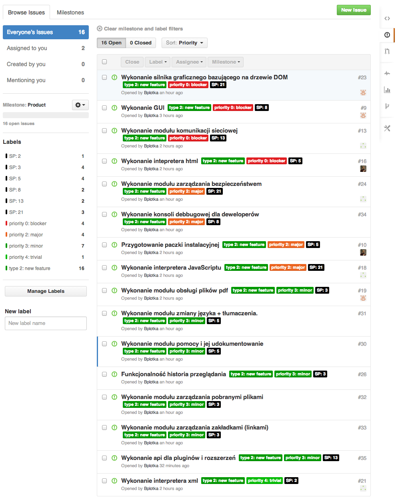
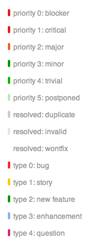

Scrum: Rejestr produktu i rejestr sprintu 1
===

1. Produkt i użytkownicy
---
Przedmiotem projektu jest przeglądarka internetowa **Firesocks**. 

Produkt umożliwiać będzie szybkie, bezpieczne i ekfektywne przeglądanie zasobów internetowych z pełną obsługą multimediów, stanowiąc doskonałe rozwiązanie dla wszystkich internautów bez względu na stopień ich zaawansowania czy wiek.

2. Scenariusze użycia systemu
---
Felek od zawsze używał swojej ulubionej przeglądarki, jednakże coraz częściej spotykając się z bardzo pozytywnymi opiniami na temat nowej przeglądarki Firesocks postanowił dać jej szanse. Po ściągnięciu i zainstalowaniu aplikacji,  kliknął dwukrotnie na miłej dla oka ikonce. Zaskoczyło go jak szybko ujrzał na ekranie gotową do użytku przeglądarkę. Wszakże jego komputer nie był pierwszej świeżości i dotychczas przychodziło mu czekać paręnaście sekund na odpalenie konkurencyjnych produktów. Ogólne „user-experience” było bardzo przyjemne – wszystko działało szybko i płynnie, a oko cieszyły przyjemne animacje. Wrażenie potęgowało to, że komputer nie był zbyt wydajny – mimo to wydajność była bez zarzutu. Ok, pomyślał Felek, pewnie haczyk tkwi w tym że tak lekka przeglądarka nie obsługuje multimediów. Postanowił więc spróbować – Youtube w jednej zakładce, w drugiej zintegrowany czytnik pdf. Do tego strona z mnogością obrazków animowanych. Wszystko bez zarzutu. Strony wymagające JavaScript działały równie szybko i niezawodnie. Felek jednakże jest wymagający, chce spersonalizować swoją przeglądarkę i zaimportować niektóre ustawienia ze starej. W intuicyjnym menu od razu odnalazł potrzebne opcje – historia, ulubione szybko zapełniły się zawartością pożądaną przez Felka. Ponadto dzięki możliwości zmiany skórki dopasował aplikacje do swoich preferencji. A co z bezpieczeństwem? Jak każdy nowy produkt tak i ten może cierpieć przecież na tak zwane choroby wieku dziecięcego – być podatnym na wirusy i ataki. Felek zasięgnął do informacji. Opinie internautów, w tym specjalistów, a także profesjonalne testy i badania szybko go uspokoiły. Program wykorzystuje wszystkie najnowsze techniki zapewniające spokój i bezpieczeństwo. Ucząc się na błędach poprzedników zagwarantował też odporność na większość ataków. Profesjonalnie i skrupulatnie przetestowana przeglądarka uniknęła błędów powodujących jakiekolwiek luki.

Felek postanowił jednakże spróbował pokazać Firesocksa swojemu tacie – niezbyt zaawansowanemu technicznie człowiekowi. Obawiał się że nie poradzi sobie z opanowaniem nowego programu będąc mocno przyzwyczajonym do swojej ulubionej przeglądarki. Ojciec Felka podszedł do nowości bardzo sceptycznie, pełen podejrzliwości patrzył na uruchomioną aplikację . Nagle do Felka zadzwonił telefon – musiał odwiedzić swojego znajomego, proszącego go o pomoc z jego programem do przeglądania internetu, który najwyraźniej odmówił współpracy. Felek wiedział jak mu pomoże – instalacja Firesocksa rozwiąże wszystkie problemy. Po zaledwie 20 minutach Felek wrócił do ojca chcąc kontynuować uczenie go nowości. Spotkała go jednak niespodzianka – tata Felka z uśmiechem na twarzy korzystał z programu, z entuzjazmem pokazując żonie jak przyjemne może być surfowanie po internecie – nawet dla starszego człowieka.

Felek wiedział, że ten dzień odmienił na zawsze sposób korzystania z internetu jego oraz najbliższych. Teraz można to robić w sposób niezawodny, szybki i intuicyjny, bez względu na wiek i stopień zaawansowania.

3. Rejestr produktu
---

###Wyjaśnienie jednostek i skal

####Priorytety
Zastosowano następującą skalę priorytetów:

* priority 0: blocker
  * Zadania blokujące inne lub najpoważniejsze błędy znalezione w wersji produkcyjnej produktu
* priority 1: critical
  * Zadania krytyczne dla pomyślnego przebiego danego sprintu i osiągnięcia zamierzonych celów
* priority 2: major
  * Zadania ważne
* priority 3: minor
  * Mniej istotne zadania
* priority 4: trivial
  * Zadania bardzo proste (np. poprawa literówki) lub prawie zupełnie nieistotne dla pomyślnego przebiegu sprintu - bardzo rzadko używane
* priority 5: postponed
  * Zadania, które z dostały się do sprintu, ale nie muszą zostać teraz wykonane - bardzo rzadko używane
  
####Typy zadań
Zastosowano następujące typy zadań:

* type 0: bug
  * Błędy
* type 1: story
  * User stories
* type 2: new feature
  * Jednostka funkcjonalności produktu
* type 3: enhancement
  * Poprawa działania funkcji zaimplementowanej wcześniej
* type 4: question
  * Pytanie, dyskusja
  
####Typy rozwiązań zadań
Dodatkowo zastosowano następujące sposoby oznaczania zadań, które nie będą realizowane:

* resolved: duplicate
  * Duplikaty zadań, które już są w backlogu
* resolved: invalid
  * Zadania (najczęściej bugi), których nie da się zweryfikować ani odtworzyć
* resolved: wontfix
  * Zadania, które nie zostaną wykonane z powodów technologicznych lub biznesowych

Oczywiście oznaczenia te nie muszą wyczerpywać potrzeb oznaczeń zadań, dlatego istnieje możliwość dodawania etykiet „w locie”.

4. Rejestr sprintu 1
---

Zakładana liczba sprintów: 9

Pojemność zespołu: 3 osoby

Cel sprintu 1: Stworzenie wersji MVP produktu (Minimum viable product)

