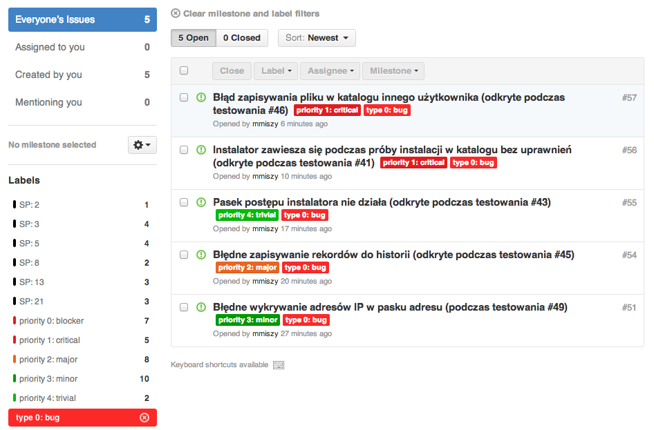
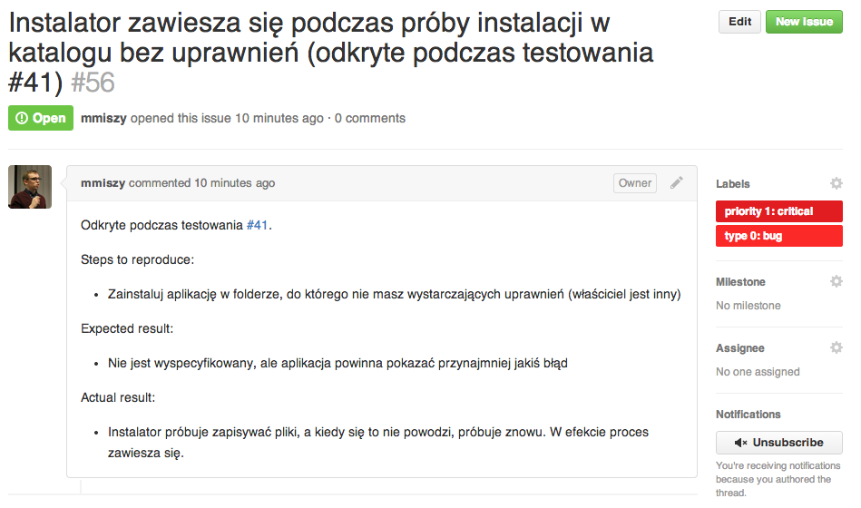
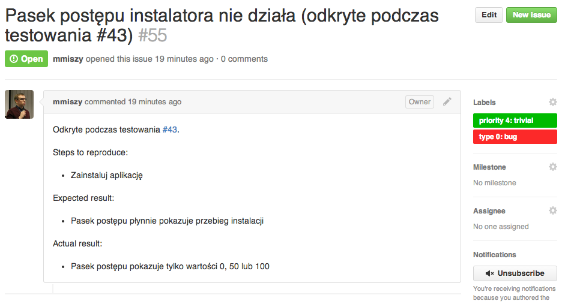
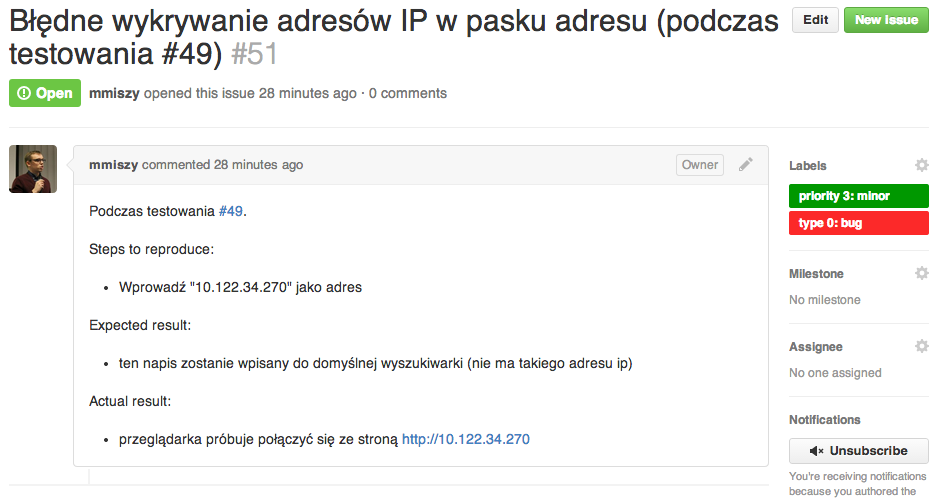

3. Scrum: Testowanie sprint 1
===

* Michał Miszczyszyn (137347)
* Bartłomiej Płotka (137378)
* Marcin Piątkowski (137371)

1. O projekcie i sprincie
---

### O produkcie

Przedmiotem projektu jest przeglądarka internetowa Firesocks.

Produkt umożliwiać będzie szybkie, bezpieczne i ekfektywne przeglądanie zasobów internetowych z pełną obsługą multimediów, stanowiąc doskonałe rozwiązanie dla wszystkich internautów bez względu na stopień ich zaawansowania czy wiek.

### Zakres sprintu

Stworzenie wersji MVP produktu (Minimum viable product).

2. Środowisko testowe
---

* **Komputer**: MacBook Pro 13-inch, Late 2011
* **System Operacyjny**: OS X 10.9.2
* **Procesor**: 2.8 GHz Intel Core i7
* **Pamięć RAM**: 8 GB 1333 MHz DDR3
* **Karta graficzna**: Intel HD Graphics 3000 512 MB
* **Kompilator**: Apple LLVM version 5.1 (clang-503.0.40) (based on LLVM 3.4svn)

3. Przypadki testowe
---

| ID        | Funkcja testowana           | Nazwa testu  | 
| :------------:|:-------------:| :-----:| 
| 50   | Est: 8h - Wykonanie podstawowego interfejsu użytkownika - walidacja inputów- Parent: #9  | Test: Sprawdznie walidatora dla inputów - pole wpisania lokalizacji instalacji |

|Opis testu |
|:---- |
| 1) Starting situation: 
Brak zainstalowanego programu na systemie, pobrany instalator 
2) Test Steps: 
 
Włączenie aplikacji instalacyjnej 
Postępowanie zgodnie z krokami 
Wybranie prostej, domyślnej instalacji 
Wybranie miejsca zapisu programu na dysku (ale użycue inputu) 
Próba wpisania znaków "X://Programs" ("nie istniejącej ścieżki) 
Próba zostawienia pustego inputu 
Próba wpisania samych cyfr "3242" 
Próba wpisania "Programs" (względną ścieżka - błędna) 
Próba wpisania "D://Programs" (instniejącej ścieżki) 
Śledzenie paska postępu 
Po zakończeniu, sprawdzenie czy aplikacja zapisała się w wybranym miejscu 
Sprawdzenie, czy zainstalowały się tylko wybrane moduły 
Włączenie aplikacji 
3) Expected situation: 
Instalor się otwiera, pozwala na wpisanie lokalizacji.
Próba wpisania znaków "X://Programs" ("nie istniejącej ścieżki) -> komunikat "nie ma takiej ściezki"
Próba zostawienia pustego inputu -> komunikat "wpisz lokalizacje!"
Próba wpisania samych cyfr "3242" -> komunikat "nie ma takiej ściezki"
Próba wpisania "Programs" (względną ścieżka - błędna) -> komunikat "nie ma takiej ścieżki"
Próba wpisania "D://Programs" (instniejącej ścieżki) -> brak komunikatu aplikacja przechodzi do instalacji Aplikacja zapisana w poprawnym miejscu na dysku, otwiera się poprawnie.. Pasek postępu płynnie pokazywał postęp instalacji |

4. Wyniki testów
---

