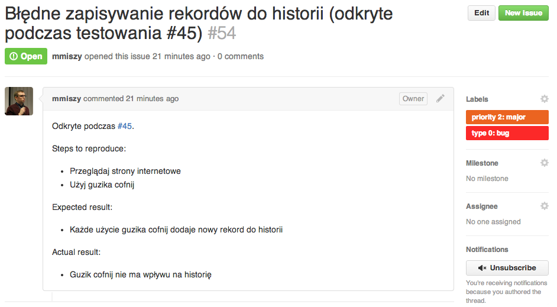

3. Scrum: Testowanie sprint 1
===

* Michał Miszczyszyn (137347)
* Bartłomiej Płotka (137378)
* Marcin Piątkowski (137371)

1. O projekcie i sprincie
---

### O produkcie

Przedmiotem projektu jest przeglądarka internetowa Firesocks.

Produkt umożliwiać będzie szybkie, bezpieczne i ekfektywne przeglądanie zasobów internetowych z pełną obsługą multimediów, stanowiąc doskonałe rozwiązanie dla wszystkich internautów bez względu na stopień ich zaawansowania czy wiek.

### Zakres sprintu

Stworzenie wersji MVP produktu (Minimum viable product).

2. Środowisko testowe
---

* **Komputer**: MacBook Pro 13-inch, Late 2011
* **System Operacyjny**: OS X 10.9.2
* **Procesor**: 2.8 GHz Intel Core i7
* **Pamięć RAM**: 8 GB 1333 MHz DDR3
* **Karta graficzna**: Intel HD Graphics 3000 512 MB
* **Kompilator**: Apple LLVM version 5.1 (clang-503.0.40) (based on LLVM 3.4svn)

3. Przypadki testowe
---

| ID        | Funkcja testowana           | Nazwa testu  | 
| :------------:|:-------------:| :-----:| 
| 50   | Est: 8h - Wykonanie podstawowego interfejsu użytkownika - walidacja inputów- Parent: #9  | Test: Sprawdznie walidatora dla inputów - pole wpisania lokalizacji instalacji |
<table>
    <thead>
        <tr>
            <th>Opis testu</th>
        </tr>
    </thead>
    <tbody>
        <tr>
            <td>
            1) Starting situation: 
Brak zainstalowanego programu na systemie, pobrany instalator 
2) Test Steps: 
 
- Włączenie aplikacji instalacyjnej 
- Postępowanie zgodnie z krokami 
- Wybranie prostej, domyślnej instalacji 
- Wybranie miejsca zapisu programu na dysku (ale użycue inputu) 
- Próba wpisania znaków "X://Programs" ("nie istniejącej ścieżki) 
- Próba zostawienia pustego inputu 
- Próba wpisania samych cyfr "3242" 
- Próba wpisania "Programs" (względną ścieżka - błędna) 
- Próba wpisania "D://Programs" (instniejącej ścieżki) 
- Śledzenie paska postępu 
- Po zakończeniu, sprawdzenie czy aplikacja zapisała się w wybranym miejscu 
- Sprawdzenie, czy zainstalowały się tylko wybrane moduły 
- Włączenie aplikacji 
3) Expected situation: 
Instalor się otwiera, pozwala na wpisanie lokalizacji.
Próba wpisania znaków "X://Programs" ("nie istniejącej ścieżki) -> komunikat "nie ma takiej ściezki"
Próba zostawienia pustego inputu -> komunikat "wpisz lokalizacje!"
Próba wpisania samych cyfr "3242" -> komunikat "nie ma takiej ściezki"
Próba wpisania "Programs" (względną ścieżka - błędna) -> komunikat "nie ma takiej ścieżki"
Próba wpisania "D://Programs" (instniejącej ścieżki) -> brak komunikatu aplikacja przechodzi do instalacji Aplikacja zapisana w poprawnym miejscu na dysku, otwiera się poprawnie.. Pasek postępu płynnie pokazywał postęp instalacji
            </td>
        </tr>
    </tbody>
</table>

---

| ID        | Funkcja testowana           | Nazwa testu  | 
| :------------:|:-------------:| :-----:| 
| 49   | Est: 8h - Wykonanie podstawowego interfejsu użytkownika - walidacja inputów- Parent: #9  | Test: Sprawdznie walidatora dla inputów - pole wpisania adresu http/https |
<table>
    <thead>
        <tr>
            <th>Opis testu</th>
        </tr>
    </thead>
    <tbody>
        <tr>
            <td>
            1) Starting situation: 
Włączona aplikacja 
2) Test Steps: 
- Wpisujemy adres "dziwny adres" 
- Wpisujemy adres "http://dziwny adres" 
- Wpisujemy adres "http://dziwny_adres" 
- Wpisujemy adres "10.122.34.123" 
- Wpisujemy adres "10.122.34.270" 
 
3) Expected situation: 
- adres "dziwny adres"  -> ten napis zostanie wpisany do domyślnej wyszukiwarki 
- adres "http://dziwny adres" -> ten napis zostanie wpisany do domyślnej wyszukiwarki 
- adres "http://dziwny_adres" -> po tym adresie pójdzie request.(strona not found) 
- adres "10.122.34.123" -> po tym adresie pójdzie request (strona not found) 
- adres "10.122.34.270" -> ten napis zostanie wpisany do domyślnej wyszukiwarki (nie ma takiego adresu ip) 
            </td> 
        </tr>
    </tbody>
</table>

---

| ID        | Funkcja testowana           | Nazwa testu  | 
| :------------:|:-------------:| :-----:| 
| 48   | Est: 5h - Wykonanie możliwości ściągania plików - zarządzanie plikami - Parent: #32  |Test: Sprawdzenie modułu ściągania plików, zbyt duży plik |
<table>
    <thead>
        <tr>
            <th>Opis testu</th>
        </tr>
    </thead>
    <tbody>
        <tr>
            <td>
            1) Starting situation: 
Włączona aplikacja, brak plików ściąganych wcześniej, miejsce na dysku jest ograniczone do 3GB 
2) Test Steps: 
- Wpisz istniejący adres strony, który ściągnie duży plik (powyżej 4GB). Miejsca na dysku jest 3GB. 
- Po przeczytaniu komunikatu że plik sie nie miesci wybierz inną lokalizacje dla pliku (tam gdzie sie zmieści) 
- W momencie postępu 100% spróbuj otworzyć plik 
- Wejdź do zarządzania pobieranymi plikami 
- Sprawdź plik. 
 
3) Expected situation: 
Przy rozpoczęciu pobierania (!) program zauważy że nie ma miejsca odpowiedniego na ten plik. Pokaże interfejst, w którym można wpisać nową lokalizacje. Element zacznie się ściągać, po dłuższym czasie będzie możliwość jego otwarcia., W module zarządznia plikami będzie data pobrania, jego wielkość i nazwa.
            </td>
        </tr>
    </tbody>
</table>

---

| ID        | Funkcja testowana           | Nazwa testu  | 
| :------------:|:-------------:| :-----:| 
| 47   | Est: 5h - Wykonanie możliwości ściągania plików - zarządzanie plikami - Parent: #32 | Test: Sprawdzenie modułu ściągania plików, duże pliki |
<table>
    <thead>
        <tr>
            <th>Opis testu</th>
        </tr>
    </thead>
    <tbody>
        <tr>
            <td>
           1) Starting situation: 
Włączona aplikacja, brak plików ściąganych wcześniej 
2) Test Steps: 
- Wpisz istniejący adres strony, który ściągnie plik:  
http://enauczanie.pg.gda.pl/moodle/mod/resource/view.php?id=11625 

- Sprawdź pasek postępu wraz z ilością pobranych kilobajtów 
- W momencie postępu 100% spróbuj otworzyć plik 

3) Expected situation: 
Element zacznie się ściągać, kiedy będzie 100% jest możliwy do otwarcia  
            </td>
        </tr>
    </tbody>
</table>

---

| ID        | Funkcja testowana           | Nazwa testu  | 
| :------------:|:-------------:| :-----:| 
| 46   | Est: 5h - Wykonanie możliwości ściągania plików - pasek postępu - Parent: #32  | Test: Sprawdzenie modułu ściągania plików, postęp ściągania |
<table>
    <thead>
        <tr>
            <th>Opis testu</th>
        </tr>
    </thead>
    <tbody>
        <tr>
            <td>
           1) Starting situation: 
Włączona aplikacja, brak plików ściąganych wcześniej, miejsce na dysku jest ograniczone do 3GB 
2) Test Steps: 
- Wpisz istniejący adres strony, który ściągnie duży plik (powyżej 4GB). 
- W momencie postępu 100% spróbuj otworzyć plik 
- Wejdź do zarządzania pobieranymi plikami 
- Sprawdź plik. 
 
3) Expected situation: 
Element zacznie się ściągać, po dłuższym czasie będzie możliwość jego otwarcia., W module zarządznia plikami będzie data pobrania, jego wielkość i nazwa.
            </td>
        </tr>
    </tbody>
</table>

---

| ID        | Funkcja testowana           | Nazwa testu  | 
| :------------:|:-------------:| :-----:| 
| 45   | Est: 20h - Wykonanie modułu zarządzaniem historii - Parent: #26 | Test: Sprawdzenie modułu historii z funkcją cofania |
<table>
    <thead>
        <tr>
            <th>Opis testu</th>
        </tr>
    </thead>
    <tbody>
        <tr>
            <td>
         1) Starting situation: 
Włączona aplikacja, wyczyszczona historia 
2) Test Steps: 
- Wpisz istniejący adres strony w polu wpisywania adresów 
- Po załadowaniu zawartości powtórz wróć do kroku 1 i wracaj tak 10 razy. 
- Guzikiem "cofnij" przywróć poprzednią zawartość strony. 
- Cofnij tak jeszcze raz 
- Cofnij tak jeszcze raz 
- Przełącz się na moduł historii przeglądania  
- Sprawdź zawartość historii 
- Skasuj 3 pierwsze elementy. 
 
3) Expected situation: 
Strona nie musi się załadować poprawnie - ten moduł nie jest sprawny. W module historii przeglądania będzie 13 rekordów z poprawnym adresem i czasem otwarcia. Skasowanie 3 elementów powiedzie się.
            </td>
        </tr>
    </tbody>
</table>

---

| ID        | Funkcja testowana           | Nazwa testu  | 
| :------------:|:-------------:| :-----:| 
| 44   | Est: 20h - Wykonanie modułu zarządzaniem historii - Parent: #26  | Test: Sprawdzenie modułu historii |
<table>
    <thead>
        <tr>
            <th>Opis testu</th>
        </tr>
    </thead>
    <tbody>
        <tr>
            <td>
           1) Starting situation: 
Włączona aplikacja, wyczyszczona historia 
2) Test Steps: 
- Wpisz istniejący adres strony w polu wpisywania adresów 
- Po załadowaniu zawartości powtórz wróć do kroku 1 i wracaj tak 10 razy. 
- Przełącz się na moduł historii przeglądania  
- Sprawdź zawartość historii 
- Skasuj 3 pierwsze elementy. 
 
3) Expected situation: 
Strona nie musi się załadować poprawnie - ten moduł nie jest sprawny. W module historii przeglądania będzie 10 rekordów z poprawnym adresem i czasem otwarcia. Skasowanie 3 elementów powiedzie się.
            </td>
        </tr>
    </tbody>
</table>

---

| ID        | Funkcja testowana           | Nazwa testu  | 
| :------------:|:-------------:| :-----:| 
| 43   | Est: 8h - Wykonanie podstawowego instalatora programu - Parent: #9  | Test: Zaawansowana instalacja programu |
<table>
    <thead>
        <tr>
            <th>Opis testu</th>
        </tr>
    </thead>
    <tbody>
        <tr>
            <td>
          1) Starting situation: 
Brak zainstalowanego programu na systemie, pobrany instalator. 
2) Test Steps: 
 
Włączenie aplikacji instalacyjnej 
- Postępowanie zgodnie z krokami 
- Wybranie zaawansowanej instalacji 
- Wybranie miejsca zapisu programu na dysku 
- Wybranie tylko niektórych modułów do zainstalowania (core, moduł bezpieczeństwa i tylko język polski) 
- Śledzenie paska postępu 
- Po zakończeniu, sprawdzenie czy aplikacja zapisała się w wybranym miejscu 
- Sprawdzenie, czy zainstalowały się tylko wybrane moduły 
- Włączenie aplikacji 
 
3) Expected situation: 
 Aplikacja zapisana w poprawnym miejscu na dysku, otwiera się poprawnie. Zainstalowano tylko podane moduły. Pasek postępu płynnie pokazywał postęp instalacji
            </td>
        </tr>
    </tbody>
</table>

---

| ID        | Funkcja testowana           | Nazwa testu  | 
| :------------:|:-------------:| :-----:| 
| 42   | Est: 8h - Wykonanie podstawowego instalatora programu - Parent: #9  | Test: Prosta instalacja program ze sprawdzeniem walidacji |
<table>
    <thead>
        <tr>
            <th>Opis testu</th>
        </tr>
    </thead>
    <tbody>
        <tr>
            <td>
            1) Starting situation: 
Brak zainstalowanego programu na systemie, pobrany instalator. 
2) Test Steps: 
 
- Włączenie aplikacji instalacyjnej 
- Postępowanie zgodnie z krokami 
- Wybranie prostej instalacji (domyślnej) 
- Wybranie miejsca zapisu programu na dysku na którym nie ma wystarczająco miejsca 
- Ponowne wybranie lokalizacji , tym razem dobrej 
- Śledzenie paska postępu 
- Po zakończeniu, sprawdzenie czy aplikacja zapisała się w wybranym miejscu 
- Włączenie aplikacji 
 
3) Expected situation: 
Instalator pokazuje użytkownikowi że nie ma wystarczająco miejsca na danym dysku. Umożliwia ponowne wybranie lokalizacji. Aplikacja zapisana w poprawnym miejscu na dysku, otwiera się poprawnie. Pasek postępu płynnie pokazywał postęp instalacji
            </td>
        </tr>
    </tbody>
</table>

---

| ID        | Funkcja testowana           | Nazwa testu  | 
| :------------:|:-------------:| :-----:| 
| 41   | Est: 8h - Wykonanie podstawowego instalatora programu - Parent: #9   | Test: Prosta instalacja programu |
<table>
    <thead>
        <tr>
            <th>Opis testu</th>
        </tr>
    </thead>
    <tbody>
        <tr>
            <td>
           1) Starting situation: 
Brak zainstalowanego programu na systemie, pobrany instalator. 
2) Test Steps: 
- Włączenie aplikacji instalacyjnej 
- Postępowanie zgodnie z krokami 
- Wybranie prostej instalacji (domyślnej) 
- Wybranie miejsca zapisu programu na dysku 
- Śledzenie paska postępu 
- Po zakończeniu, sprawdzenie czy aplikacja zapisała się w wybranym miejscu 
- Włączenie aplikacji 
 
3) Expected situation: 
 Aplikacja zapisana w poprwanym miejscu na dysku, otwiera się poprawnie. Pasek postępu płynnie pokazywał postęp instalacji
            </td>
        </tr>
    </tbody>
</table>

4. Wyniki testów
---

